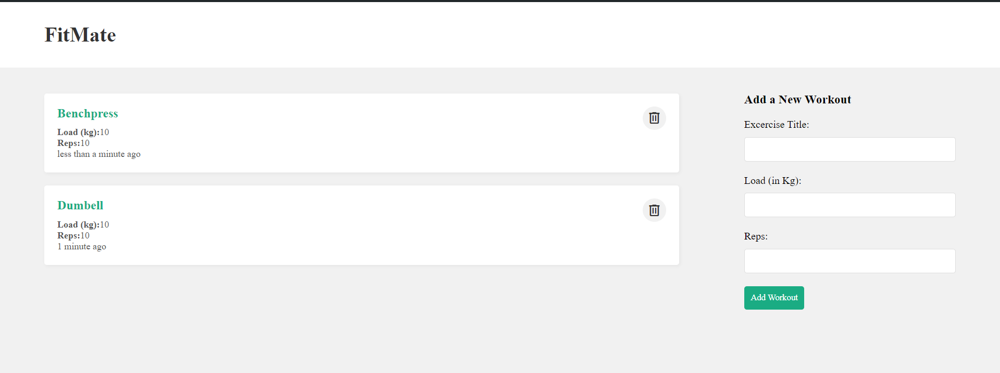

---

# FitMate

## Overview

FitMate is a web application designed to help users manage their workout routines. It allows users to efficiently track their exercises by enabling them to add and delete workouts, providing an intuitive and interactive platform for workout management.

![FitMate Overview]

## Key Features

- **Add Workouts:** Users can input new workout routines, including details such as exercises, duration, and intensity.
- **Delete Workouts:** Users can remove workouts they no longer need, ensuring their workout list remains current and relevant.

## Tech Stack

FitMate is built using the MERN stack, which includes the following technologies:

- **MongoDB:** A NoSQL database for storing workout data with a flexible schema to accommodate various workout details and support efficient data retrieval.
- **Express.js:** A web application framework for Node.js, managing server-side logic and routing. It handles API requests and processes user interactions with the database.
- **React:** A JavaScript library for building user interfaces, used to create the frontend of the application. It provides a responsive and interactive user experience.
- **Node.js:** A JavaScript runtime that powers the server-side of the application, running the Express server and handling backend operations.

## How It Works

- **Frontend:** Built with React, the frontend allows users to interact with the application through a web interface. Users can add and delete workouts using the provided forms and buttons.
- **Backend:** Built with Node.js and Express, the backend manages API requests from the frontend. It performs operations such as saving workout data to the MongoDB database and handling user interactions.
- **Integration:** The frontend communicates with the backend via API calls to perform CRUD (Create, Read, Update, Delete) operations on workout data.

---
